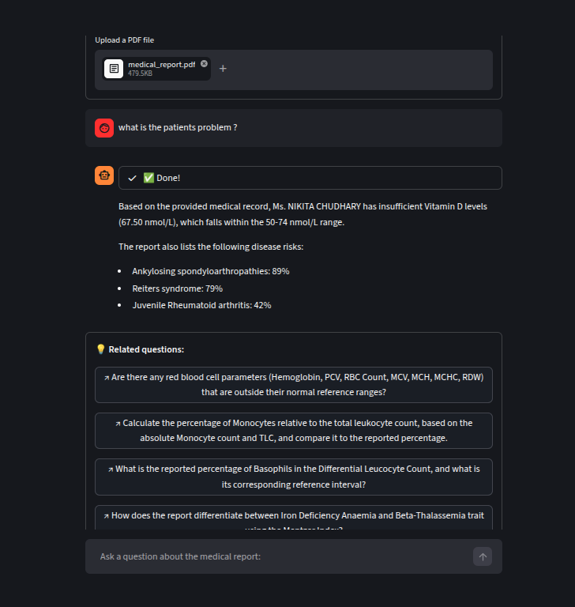
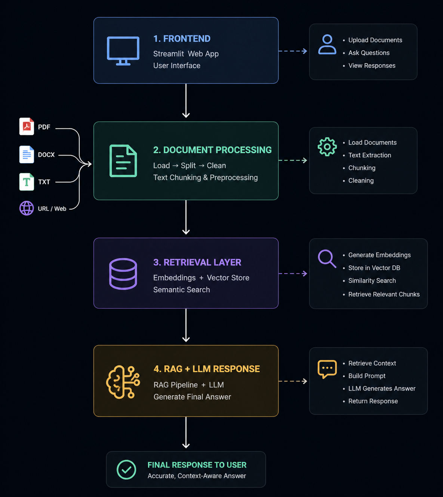

# AI Research RAG Agent

An AI-powered research workflow system built to move beyond basic PDF chatbots.

This project allows users to upload documents, ask complex questions, retrieve relevant context, and perform research-focused querying using Retrieval-Augmented Generation (RAG).

## Current Features

* Document upload + processing
* Vector-based retrieval using ChromaDB
* Multi-query document Q&A
* Context-aware answer generation
* Research-focused workflows


### Screenshots



## Current Stack

- Streamlit
- LangChain
- ChromaDB
- Python

### Tech Stack and Architecture


## Current Limitations

This is still V1 and not production-grade yet.

Current limitations:

* single-document workflow
* no FastAPI backend
* no PostgreSQL integration
* no authentication
* limited orchestration
* retrieval optimization in progress

## Next Upgrades

* FastAPI backend
* PostgreSQL architecture
* multi-document workflows
* source citations
* retrieval improvements
* agent orchestration
* web research fallback

## Goal

To build a real AI Research Workspace — not just another PDF chatbot.

## Demo

### Loom Walkthrough

(Add Loom video link here)


## Setup

Environment Variables

Create a file named:

.env

Use the structure as per .env.example:

GOOGLE_API_KEY = your_api_key_here

```bash id="j7r8k2"
git clone YOUR_GITHUB_REPOSITORY_LINK
cd YOUR_PROJECT_FOLDER_NAME
pip install -r requirements.txt
streamlit run app.py
```

## Contact

Contact

LinkedIn: [Tridib Dey](https://www.linkedin.com/in/tridib-dey-3276b5405/) | GitHub: [Tridib-dev](https://github.com/Tridib-dev) | X: [@tridib_deylabs](https://x.com/tridib_deylabs) | Email: tridib.deylabs@gmail.com

## Status

V1 Built → Production Architecture Upgrade in Progress
